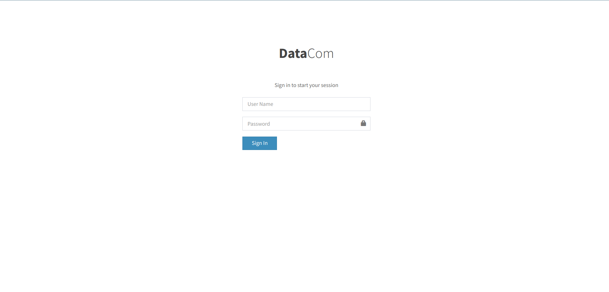
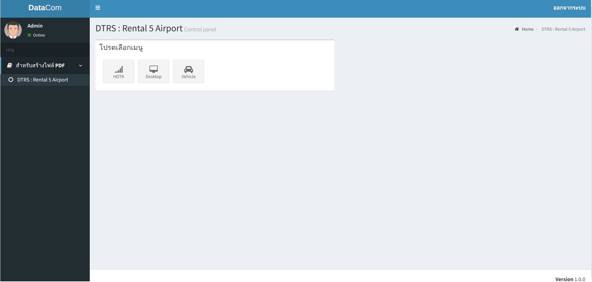
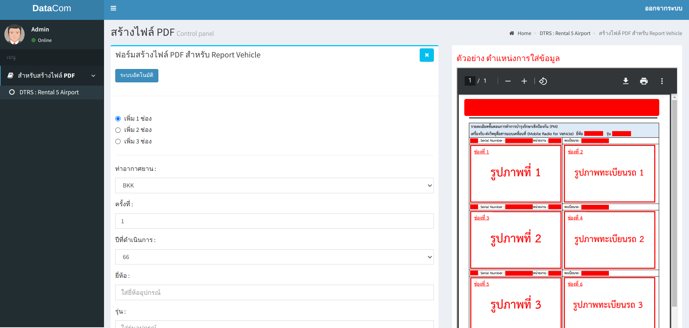
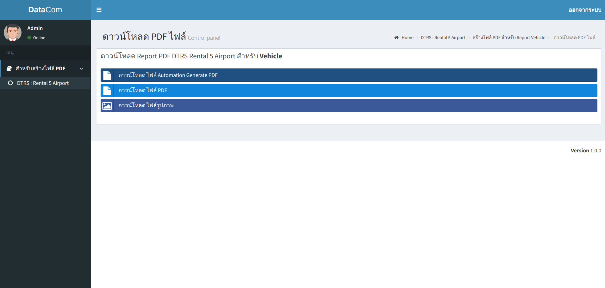
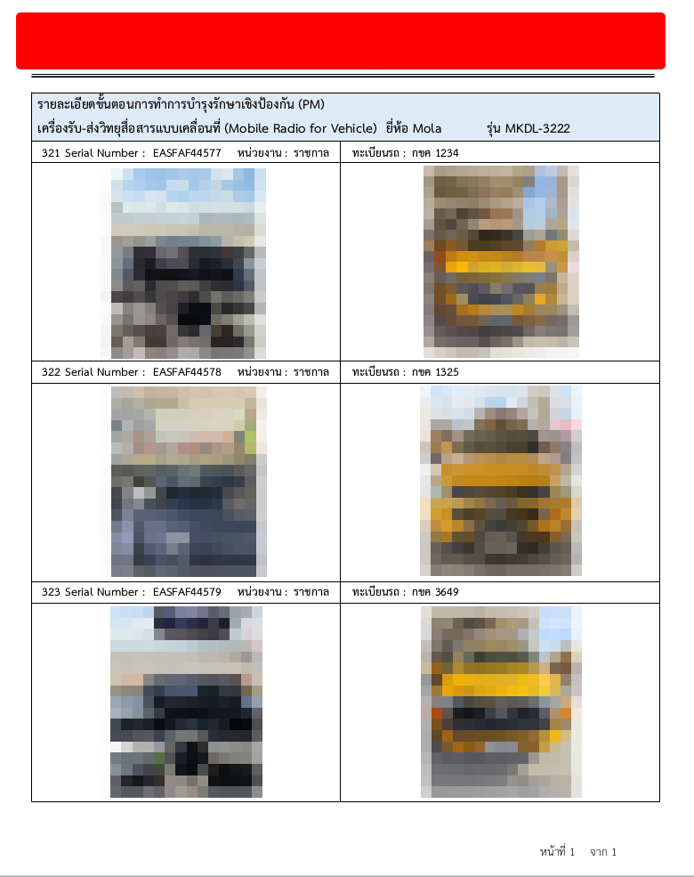

# generatePDF-reactjs-nodejs-docker

- เป็นระบบ Generate ไฟล์ PDF ตาม Pattern ที่กำหนด ที่พัฒนาด้วย ReactJS เป็น frontend และใช้ NodeJS เป็น Webservice API โดยใช้ framework ที่ชื่อว่า Express
- โดยระบบจะมี 2 ฟังก์ชั่น คือ Manual Generate และ Automation Generate
- Manual Generate จะมีช่อง Input ข้อความให้กรอก เพื่อ map ข้อความที่กรอก ลงบน PDF
- Automation Generate จะ map ข้อความจาก ไฟล์ xlsx และเอาข้อความของช่อง xlsx บันทึกลง PDF ให้อัตโนมัติ โดยไม่ต้อง Manual Generate ที่ละอัน
- โดยระบบทั้งหมด Deploy บน Virtualization Technology คือ Docker
- ประโยชน์ของระบบนี้ คือ ลดเวลาการทำงานในส่วนของการทำ Report ต่างๆ โดยระบบจะปรับและจัดเรียง ตำแหน่งข้อมความ หรือรูปภาพให้อัตโนมัติ ทำให้สะดวกสะบายในการทำงานมากยิ่งขึ้น

## Tech Stack in Project 

- **Language**
    - JavaScript(ReactJS)
    - JavaScript(NodeJS)
- **State Management**
    - React Context API
- **Framework**
    - Bootstrap v3.3.7
    - Template AdminLTE v2.4.10
- **Virtualization Technology**
    - Docker
- **Libraries** 
    - PDF-LIB
    - Compressing
    - FS-Extra
    - XLSX
    - Express
    - CORS
    


## Get Started
1. install Docker
- [Installation Docker](https://docs.docker.com/engine/install/)

2. install project with Shell script for Linux

```bash
  cd generatePDF-reactjs-nodejs-docker
  cd sh
  su
  Password: <password admin>
  ./install.sh 
```

## Screenshots

ตัวอย่าง : หน้า Login เข้าสู่ระบบ



- username : admin
- password : P@ssw0rd@admin

ตัวอย่าง : หน้าเมนูการทำ Report



ตัวอย่าง : หน้าแบบ Form กรอกข้อมูล แบบ Manual Generate



ตัวอย่าง : หน้าแบบ Form กรอกข้อมูล แบบ Automation Generate


ตัวอย่าง : หน้า Export file



ตัวอย่าง : ไฟล์ PDF ที่ได้จากการ Generate




## Used By
[](https://github.com/TopThiraphat)

## Support Me
[](https://ko-fi.com/R5R0RDJVK)


