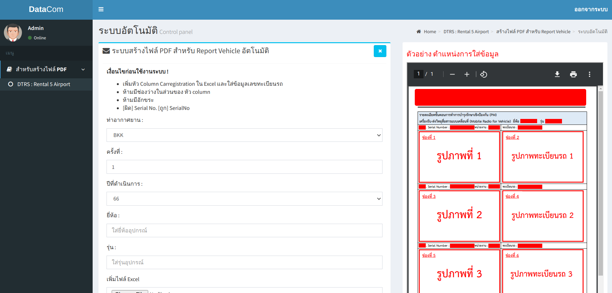

# generatePDF-reactjs-nodejs-docker

- เป็นระบบ generate ไฟล์ PDF ที่พัฒนาด้วย ReactJS เป็น frontend และใช้ NodeJS เป็น Webservice API โดยใช้ framework ที่ชื่อว่า Express
- โดยระบบจะมี 2 ฟังก์ชั่น คือ manual generate และautomation generate
- manual generate จะมีช่อง input ข้อความสำหรับกรอก เพื่อใช้ map ข้อความ เพื่อพอดลง PDF
- automation generate จะmap ข้อความจาก xlsx และเอามา พอดลง PDF ให้อัตโนมัติโดยไม่ต้อง พิมพ์ในช่อง input ที่ละอัน
- โดยระบบทั้งหมด deploy บน virtualization technology คือ Docker

## Tech Stack in Project 

- **Language**
    - javascript(reactjs)
    - javascript(nodejs)
- **framework**
    - bootstrap v4
    - template adminLTE v2.4.10
- **Virtualization Technology**
    - docker
- **Libraries** 
    - pdf-lib
    - compressing
    - fs-extra
    - xlsx
    - express
    - cors
    


## Get Started
1. install Docker
- [Installation Docker](https://docs.docker.com/engine/install/)

2. install project with Shell script for Linux

```bash
  cd generatePDF-reactjs-nodejs-docker
  cd sh
  su
  Password: <password admin>
  ./install.sh 
```

## Screenshots





ตัวอย่าง ไฟล์ PDF ที่ได้จากการ Generate


## Used By
[](https://github.com/TopThiraphat)

## Support Me
[](https://ko-fi.com/R5R0RDJVK)


